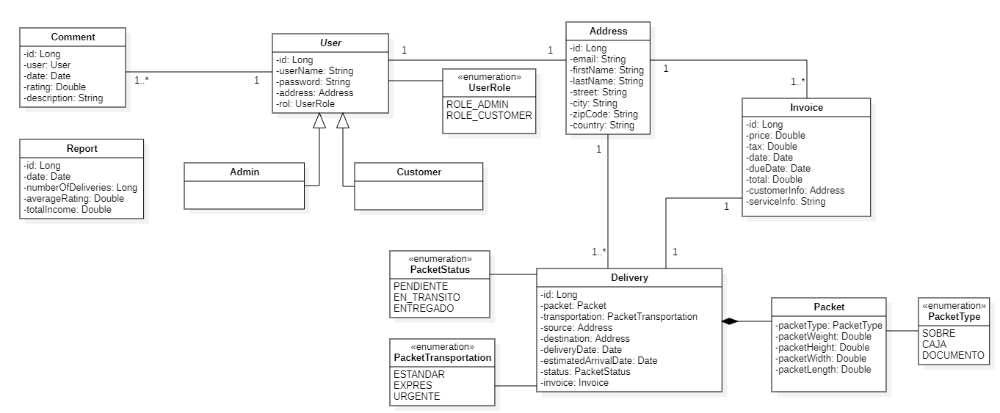

# Proyecto-tienda-remo

## Guía

Es necesario tener instalado Maven como gestor de dependencias y del proyecto así como una versión de Java 17 o superior.

1. Clona el proyecto en local
    ```bash
    git clone https://github.com/alvaroLorente1/Proyecto-tienda-remo.git
    ```

## Motivación
Se desea implementar una aplicación que gestione el envío y seguimiento de paquetes en una empresa de transporte, se llevará el control de los envíos de paquetería.

## Funcionamiento
Un usuario accede a la aplicación y puede elegir entre hacer un envío o realizar el seguimiento de un envío ya realizado.  

Para consultar los detalles de un envío ya realizado, no es necesario ser cliente dado de alta en el sistema. Sin embargo, para poder realizar un envío hay que darse de alta como cliente para poder elegir los detalles del envío, así como poder descargar la factura correspondiente.  

Los clientes podrán valorar y dejar comentarios sobre el servicio ofrecido para que el administrador pueda incluir mejoras en la aplicación. 
Además, el administrador tendrá un panel de control para poder realizar operaciones sobre los usuarios, y además, registrar nuevos usuarios.  

Por último, el administrador desde el panel podrá generar un reporte del estado actual de la empresa en el que se detallen el número de envíos gestionados, la puntuación media del servicio y los ingresos totales en el sistema.

## Arquitectura
Para implementar la aplicación, se ha decidido dividir las funcionalidades en los siguientes servicios: usuarios, envíos, reportes, comentarios y facturas.



 **Servicio de gestión de usuario**  

Es el encargado de gestionar toda la lógica relacionada con los usuarios del sistema, que podrán ser los siguientes:  

* Visitante: usuarios que acceden a la página web para obtener información sobre los servicios ofrecidos. 
No están autenticados.
No tienen acceso a funciones de envío o gestión.
Pueden consultar el estado básico de cualquier envío.
Puede registrarse en el sistema como cliente.
Puede ver las valoraciones de otros clientes sobre el servicio.
* Cliente: representa al usuario que se autentica en el sistema.
Puede crear y consultar los detalles de los envíos que ha realizado. 
Puede modificar su perfil de usuario pero no puede eliminarlo.
Puede descargar la factura de un envío.
Puede añadir una valoración sobre el funcionamiento del sistema.
* Administrador: es un tipo de usuario que representa al administrador del sistema o gestor de la empresa que utiliza la aplicación.Puede hacer lo mismo que un cliente y además:
Crear o modificar clientes.
Eliminar clientes excepto a sí mismo.
Generar un reporte de operaciones incluyendo el número de envíos realizados, la puntuación media y los ingresos del sistema.
