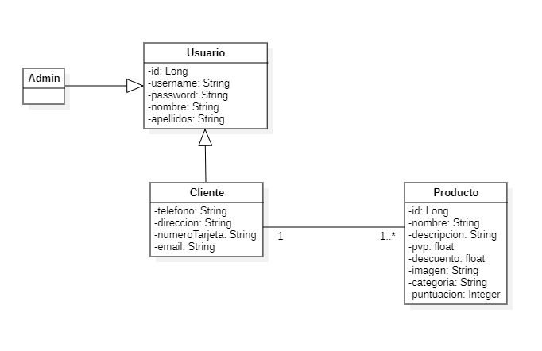
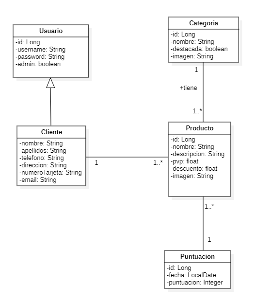

# Proyecto-tienda-remo

## Guía

1. Clona el proyecto en local
    ```bash
    git clone https://github.com/alvaroLorente1/Proyecto-tienda-remo.git
    ```

## Motivación
Se desea implementar una aplicación que gestione los productos de una tienda, así como la gestion de los usuarios del sistema.

## Funcionamiento
Un usuario accede a la aplicación y puede elegir entre hacer un envío o realizar el seguimiento de un envío ya realizado.  

Para consultar los detalles de un envío ya realizado, no es necesario ser cliente dado de alta en el sistema. Sin embargo, para poder realizar un envío hay que darse de alta como cliente para poder elegir los detalles del envío, así como poder descargar la factura correspondiente.  

Los clientes podrán valorar y dejar comentarios sobre el servicio ofrecido para que el administrador pueda incluir mejoras en la aplicación. 
Además, el administrador tendrá un panel de control para poder realizar operaciones sobre los usuarios, y además, registrar nuevos usuarios.  

Por último, el administrador desde el panel podrá generar un reporte del estado actual de la empresa en el que se detallen el número de envíos gestionados, la puntuación media del servicio y los ingresos totales en el sistema.

## Diagrama analisis


## Diagrama diseño



## Arquitectura
Para implementar la aplicación, se ha decidido dividir las funcionalidades en los siguientes servicios:

 **Servicio de gestión de usuario**  
Es el encargado de gestionar toda la lógica relacionada con los usuarios del sistema, que podrán ser los siguientes:

- Visitante: usuarios que acceden a la página web para obtener información sobre los servicios ofrecidos. No están autenticados.
Puede registrarse en el sistema como cliente.
Puede ver la lista de productos.
- Cliente: representa al usuario que se autentica en el sistema.
Habrá que indicar su direccion, número de tarjeta y telefono
Puede modificar su perfil de usuario pero no puede eliminarlo.
Puede ver la lista de productos de la tienda.

- Administrador: es un tipo de usuario que representa al administrador del sistema o gestor de la empresa que utiliza la aplicación.Puede hacer lo mismo que un cliente y además:
Crear o modificar clientes.
Eliminar clientes.
Crear, editar o eliminar productos de la tienda.
Crear, editar o eliminar categorías


 **Gestión de productos**  
Cada producto incluye la informacion detallada de cada uno así como su nombre, descripcion, precio, imagen y su identificador.
Los productos estarán separados por categoría.

**Gestión de categorias** 
El administrador puede añadir, eliminar o modificar una categoría.
Las categorías que podemos encontrar son : Barcos, componentes, o ropa deportiva.


