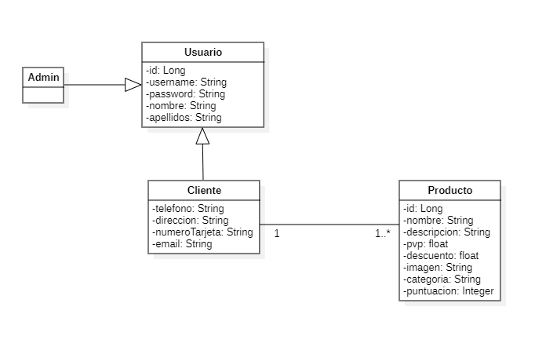
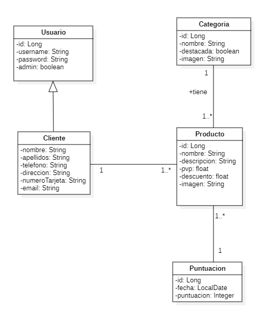

# 🚣 Sistema de Gestión de Tienda de Remo

Aplicación web para la gestión de productos, clientes y categorías de una tienda especializada en equipamiento de remo. Sistema con autenticación basada en roles (Administrador/Cliente) desarrollado con Spring Boot y Thymeleaf.

## 🛠️ Stack tecnológico

- **Framework**: Spring Boot 3.3.0
- **Java**: 17
- **Persistencia**: Spring Data JPA + Hibernate
- **Base de datos**: H2 (file-based)
- **Seguridad**: Spring Security 6
- **Template Engine**: Thymeleaf con Spring Security extras
- **Build Tool**: Maven
- **Utilidades**: Lombok

## 📋 Requisitos previos

- ☕ Java JDK 17 o superior
- 📦 Maven 3.6+ (incluye wrapper `mvnw`)

## ⚙️ Instalación y configuración

### 1️⃣ Clonar el repositorio
```bash
git clone https://github.com/alvaroLorente1/Proyecto-tienda-remo.git
cd Proyecto-tienda-remo/ProyectoTiendaRemoAlvaroLorenteAlman
```

### 2️⃣ Ejecutar la aplicación
```bash
# Linux/Mac
./mvnw spring-boot:run

# Windows
mvnw.cmd spring-boot:run
```

### 3️⃣ Acceder a la aplicación
- **URL**: http://localhost:9000
- **Login**: http://localhost:9000/login
- **H2 Console**: http://localhost:9000/h2-console

## 🔑 Credenciales de acceso

### 👤 Usuario administrador
- **Username**: `admin`
- **Password**: `admin`
- **Privilegios**: Gestión completa de productos, categorías y clientes

### 👥 Usuarios clientes
| Username | Password | Nombre completo |
|----------|----------|-----------------|
| `user`   | `1234`   | John Smith |
| `user2`  | `1234`   | Jane Doe |
| `user3`  | `1234`   | Robert Johnson |

## 💾 Configuración de base de datos

### H2 Console
- **JDBC URL**: `jdbc:h2:./db/basededatos;DB_CLOSE_ON_EXIT=FALSE`
- **Username**: `sa`
- **Password**: *(vacío)*
- **Driver**: `org.h2.Driver`

### Persistencia
- 📁 La base de datos se almacena en `./db/basededatos.mv.db`
- 🔄 Schema se recrea en cada inicio (`ddl-auto=create-drop`)
- 📝 Datos iniciales cargados desde `src/main/resources/import.sql`

## 📂 Estructura del proyecto

```
ProyectoTiendaRemoAlvaroLorenteAlman/
├── src/main/java/.../
│   ├── controller/          # Controladores MVC
│   │   ├── CategoriaController.java
│   │   ├── ClienteController.java
│   │   ├── ProductoController.java
│   │   └── MainController.java
│   ├── model/              # Entidades JPA
│   │   ├── Usuario.java    # Entidad base (UserDetails)
│   │   ├── Cliente.java    # Hereda de Usuario
│   │   ├── Producto.java
│   │   ├── Categoria.java
│   │   └── Puntuacion.java
│   ├── repository/         # Repositorios JPA
│   ├── service/            # Capa de servicio
│   │   └── base/          # BaseService genérico
│   └── security/           # Configuración de seguridad
│       ├── SecurityConfig.java
│       ├── UserDetailsServiceImpl.java
│       ├── RoleBasedSuccessHandler.java
│       └── PasswordEncoderConfig.java
└── src/main/resources/
    ├── application.properties
    ├── import.sql          # Datos iniciales
    ├── static/             # CSS, JS, imágenes
    └── templates/          # Vistas Thymeleaf
```

## 🗂️ Modelo de datos

### Jerarquía de usuarios
```
Usuario (JOINED inheritance)
  ├── id, username, password, admin
  └── Cliente extends Usuario
      └── nombre, apellidos, telefono, direccion, numeroTarjeta, email
```

### Relaciones
- **Producto** `ManyToOne` **Categoria**
- **Producto** `OneToMany` **Puntuacion** (ratings)

### Categorías predefinidas
- 🔧 Componentes (orza, timón, palas)
- 🚤 Barcos (1x, 2x, 2-, 4-, 4x, 8+)
- 👕 Ropa deportiva (platanitos, térmicas)

## 🔐 Seguridad y control de acceso

### Configuración de roles
| Ruta | ADMIN | USER | Público |
|------|-------|------|---------|
| `/categoria/**` | ✓ | ✗ | ✗ |
| `/cliente/**` | ✓ | ✗ | ✗ |
| `/admin/**` | ✓ | ✗ | ✗ |
| `/producto/**` | ✓ | ✓ | ✗ |
| `/login`, `/registro` | ✓ | ✓ | ✓ |
| `/css/**`, `/js/**`, `/img/**` | ✓ | ✓ | ✓ |

### Flujo de autenticación
1. 🔑 Login → `UserDetailsServiceImpl` carga usuario desde DB
2. 🔒 `PasswordEncoder` valida credenciales
3. 🔀 `RoleBasedSuccessHandler` redirige según rol:
   - **ADMIN** → `/admin/index`
   - **USER** → `/web/index`

## 🌐 Endpoints principales

### 📦 Productos
- `GET /producto` - Lista de productos (AUTH requerido)
- `GET /producto/nuevo` - Formulario nuevo producto (ADMIN)
- `POST /producto/nuevo` - Crear producto (ADMIN)
- `GET /producto/editar/{id}` - Editar producto (ADMIN)
- `GET /producto/borrar/{id}` - Eliminar producto (ADMIN)

### 🏷️ Categorías
- `GET /categoria` - Lista categorías (ADMIN)
- `GET /categoria/nuevo` - Nueva categoría (ADMIN)
- `POST /categoria/nuevo` - Crear categoría (ADMIN)

### 👤 Clientes
- `GET /cliente` - Lista clientes (ADMIN)
- `GET /cliente/nuevo` - Nuevo cliente (ADMIN)
- `GET /cliente/editar/{id}` - Editar cliente (ADMIN)

## 💻 Comandos de desarrollo

### ⚙️ Compilar
```bash
./mvnw clean compile
```

### 🧪 Ejecutar tests
```bash
./mvnw test
```

### 📦 Generar JAR
```bash
./mvnw clean package
# JAR generado en target/proyectotiendaremoalvarolorentealman-0.0.1-SNAPSHOT.jar
```

### ▶️ Ejecutar JAR
```bash
java -jar target/proyectotiendaremoalvarolorentealman-0.0.1-SNAPSHOT.jar
```

## 📊 Diagramas de arquitectura

### Diagrama de análisis


### Diagrama de diseño


## ⚡ Funcionalidades del sistema

### 🌍 Rol visitante (No autenticado)
- 👁️ Visualización de productos públicos
- ✍️ Registro como cliente

### 👤 Rol cliente (USER)
- 📋 Visualización de catálogo completo
- 🛒 Gestión de cesta de compra
- ✏️ Modificación de perfil propio
- ⭐ Puntuación de productos

### 👑 Rol administrador (ADMIN)
- **🔧 Gestión de productos**: CRUD completo
- **🏷️ Gestión de categorías**: Crear, modificar, eliminar
- **👥 Gestión de clientes**: CRUD completo
- ➕ Todas las funcionalidades de cliente

## 📝 Notas técnicas

- **CSRF**: Deshabilitado en `SecurityConfig` (línea 60)
- **Frame Options**: Deshabilitado para acceso a H2 Console
- **Password Encoding**: Configurado con `PasswordEncoderConfig`
  - Datos de prueba usan `{noop}` prefix (sin encoding)
- **Lombok**: Genera getters/setters/constructores automáticamente
- **Puntuación**: Cálculo de media mediante Stream API en `Producto.getPuntuacionMedia()`
